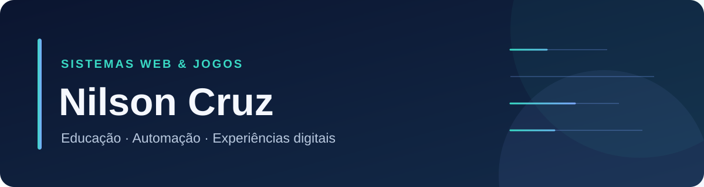
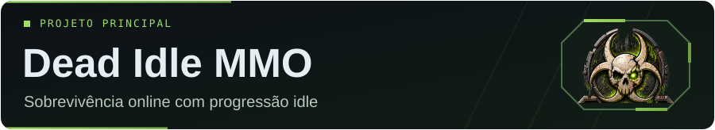
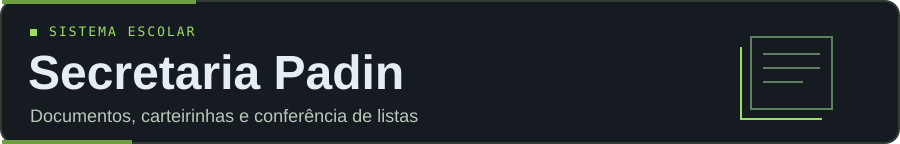
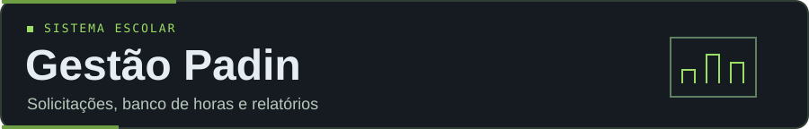
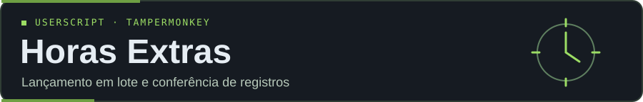
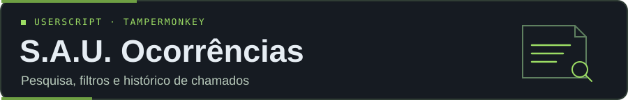
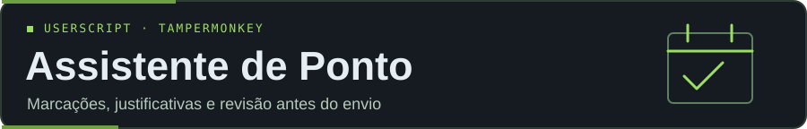

  
   
  

<h1 align="center">Olá, eu sou Nilson Cruz 👋</h1>

  Desenvolvo sistemas web para simplificar rotinas de trabalho e criar experiências digitais. 
  Meus projetos unem educação, automação e jogos.

  
  

  
  
  
  

## Tecnologias

<table align="center">
  <tr>
    <td align="center" width="110"> React</td>
    <td align="center" width="110"> TypeScript</td>
    <td align="center" width="110"> JavaScript</td>
    <td align="center" width="110"> Python</td>
  </tr>
  <tr>
    <td align="center"> NestJS</td>
    <td align="center"><picture><source media="(prefers-color-scheme: dark)" srcset="assets/tech-icons/flask-dark.svg" /></picture> Flask</td>
    <td align="center"> PostgreSQL</td>
    <td align="center"> Docker</td>
  </tr>
</table>

## Projetos em destaque

  
  

Um jogo online de sobrevivência com progressão idle, combate, coleta, criação de itens e eventos em tempo real. **React · TypeScript · NestJS · Prisma · PostgreSQL · Redis**

Um sistema para gerar documentos e carteirinhas, organizar planilhas e conferir listas escolares. **Python · Flask · pandas · openpyxl**

Uma central interna para solicitações, banco de horas, relatórios e comunicação da unidade escolar. **Python · Flask · SQLAlchemy · HTML**

## Scripts e automações

Ferramentas para facilitar rotinas em sistemas existentes. São projetos independentes executados no navegador com **JavaScript · Tampermonkey**.

Cadastro de vários dias em lote, consulta, conferência de registros e apoio à recuperação de operações incertas. **Versão beta 4.6.0-beta.18.**

Pesquisa, filtros, histórico e prévia de ocorrências na interface do S.A.U. **Versão 1.0.1 em validação interna.**

Conferência de marcações e preparo de justificativas, com revisão e consulta após o envio. **Versão 3.50.0 em teste.**

## Atividade no GitHub

O gráfico de contribuições do próprio GitHub aparece logo abaixo deste README. Ele mostra a evolução da atividade ao longo do ano.

  
  

<h3 align="center">Linguagens dos repositórios públicos</h3>

  

Ícones de tecnologias: <a href="https://github.com/devicons/devicon">Devicon</a> (licença MIT em <a href="assets/tech-icons/LICENSE">assets/tech-icons/LICENSE</a>).
